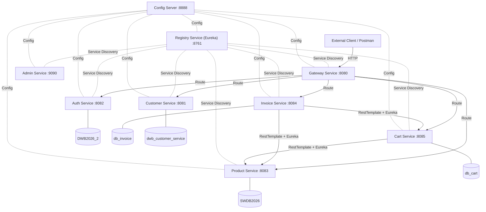
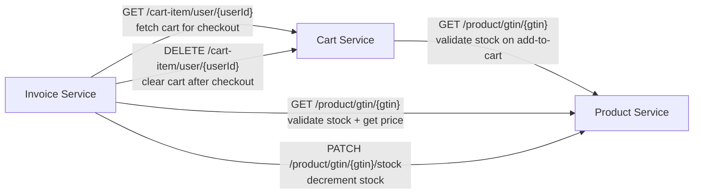
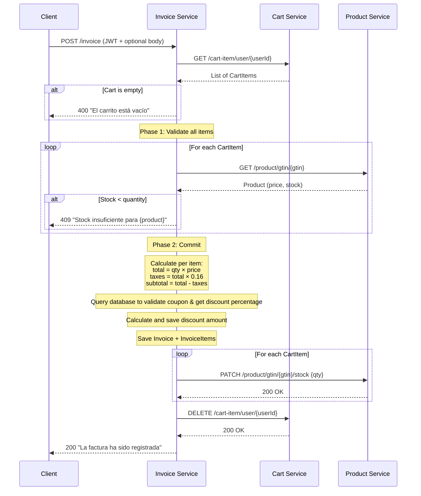

# Ecosistema de Microservicios SWDB 2026

Este es el repositorio orquestador central (**swdb-main**) para el proyecto final de la materia. Sirve como el punto de entrada unificado para la evaluación académica y contiene los scripts de configuración, colección de APIs para pruebas y las directrices globales del sistema.

---

## Directorio de Servicios

Todos los componentes de este ecosistema de microservicios están modularizados en sus propios repositorios independientes bajo la convención de nomenclatura `swdb-`:

| Servicio | Puerto | Descripción | Repositorio |
|---|---|---|---|
| **Orquestador Principal** | N/A | Scripts de inicio, base de datos y pruebas (este repositorio) | [swdb-main](./README.md) |
| **Config Server** | `8888` | Servidor central de configuración distribuida (Spring Cloud Config) | [swdb-config-server](https://github.com/toporaku/swdb-config-server) |
| **Registry Service** | `8761` | Servidor de descubrimiento de servicios (Netflix Eureka) | [swdb-registry-service](https://github.com/toporaku/swdb-registry-service) |
| **Gateway Service** | `8080` | Puerta de enlace unificada y enrutamiento perimetral (Spring Cloud Gateway) | [swdb-gateway-service](https://github.com/toporaku/swdb-gateway-service) |
| **Admin Service** | `9090` | Panel de monitoreo visual para administración (Spring Boot Admin) | [swdb-admin-service](https://github.com/toporaku/swdb-admin-service) |
| **Auth Service** | `8082` | Servicio de autenticación, registro y generación de tokens JWT | [swdb-auth-service](https://github.com/toporaku/swdb-auth-service) |
| **Product Service** | `8083` | Gestión de catálogo de productos, stock y categorías de venta | [swdb-product-service](https://github.com/toporaku/swdb-product-service) |
| **Customer Service** | `8081` | Gestión de perfiles de clientes asociados a usuarios de seguridad | [swdb-customer-service](https://github.com/toporaku/swdb-customer-service) |
| **Cart Service** | `8085` | Almacenamiento temporal y gestión de ítems en carritos de compra | [swdb-cart-service](https://github.com/toporaku/swdb-cart-service) |
| **Invoice Service** | `8084` | Orquestador transaccional que finaliza la compra y emite facturas | [swdb-invoice-service](https://github.com/toporaku/swdb-invoice-service) |

---

## Instrucciones de Configuración Inicial

Para levantar todo el ecosistema de forma local, siga los siguientes pasos:

### Paso 1: Configurar la Base de Datos en MySQL
1. Abra su cliente o consola de MySQL e inicie sesión como administrador (`root`).
2. Ejecute el script SQL que inicializa las bases de datos y configura el usuario de aplicación dedicado:
   ```bash
   mysql -u root -p < setup.sql
   ```
   *Este script se encargará de crear el usuario exclusivo `swdb_user` con contraseña `Swdb_2026_Project!` y le asignará permisos totales sobre las 5 bases de datos que requiere la aplicación.*

### Paso 2: Iniciar los Microservicios
Ofrecemos dos alternativas para el arranque según su sistema operativo y herramientas:

*   **Opción A (Recomendada - Multiplataforma):**
    Si cuenta con Python 3 instalado, ejecute el orquestador:
    ```bash
    python run_services.py
    ```
    *Este script realiza una limpieza de puertos, arranca los servicios de forma ordenada y redirige las salidas a la carpeta `logs/`.*

*   **Opción B (Sistemas Unix/macOS):**
    Ejecute el script de Bash:
    ```bash
    chmod +x start.sh
    ./start.sh
    ```

*   **Opción C (Sistemas Windows):**
    Ejecute el archivo de procesamiento por lotes:
    ```cmd
    start.bat
    ```

---

## Guía de Pruebas y Validación (Postman)

Hemos integrado una colección de APIs completa lista para importarse y ejecutarse en su herramienta de pruebas preferida (Postman):

1. **Archivo de Colección:** [swdb-postman-collection.json](./swdb-postman-collection.json).
2. **Cómo Importar:** Abra Postman, seleccione la opción **Import** y cargue el archivo JSON.
3. **Flujo de Ejecución:**
   * La colección cuenta con un orden lógico secuencial (Autenticación -> Clientes -> Productos -> Carrito -> Facturación).
   * **Variables de Entorno:** Utiliza la variable global `gateway_url` con valor predeterminado `http://localhost:8080`.
   * **JWT Automático:** Al ejecutar el endpoint de **Iniciar Sesión**, el script de prueba integrado guardará dinámicamente el token JWT en la variable de entorno `jwt_token`. Las siguientes peticiones usarán este token de manera automática en su cabecera `Authorization`.
4. **Verificación Automatizada:** Cada petición en la colección tiene pruebas (assertions) incorporadas que validan que el servidor responda con códigos exitosos (`200 OK` o `201 Created`) y un formato JSON correcto. Puede correr toda la colección en el **Collection Runner** para una evaluación automática del 100% del flujo.

---

## Diseño Arquitectónico del Sistema

A continuación se presenta el diagrama de arquitectura de alto nivel del ecosistema:



### Tech Stack

- **Java 21**, **Spring Boot 4.0.6**, **Spring Cloud 2025.1.1** 
- **MySQL 9.x** on localhost:3306
- **Maven** build system
- **jjwt 0.11.5** 
- **springdoc-openapi 2.8.6**

## Comunicación interna



### Diagrama de Secuencia del Checkout



## Funcionalidades Extra del Checkout (Persistencia y Cupones)

### 1. Dirección de Envío e Información de Pago
Al procesar una compra a través del cuerpo (`body`) en `POST /invoice`, se pueden especificar los datos opcionales de envío y pago (ej: `"shipping_address"`, `"payment_method"`). Estos datos se persisten de manera estructurada en la tabla `invoice` de `db_invoice`.

### 2. Catálogo Dinámico de Cupones de Descuento
En lugar de realizar una comprobación estática en el código, el sistema utiliza un catálogo de cupones almacenado en la base de datos `db_invoice` mediante la tabla `coupon`:
*   **Estructura de la Tabla `coupon`:**
    *   `coupon_id` (PK, Autoincremental)
    *   `code` (Código del cupón, único y sensible a mayúsculas/minúsculas, ej: `"SAVE10"`)
    *   `discount_percentage` (Porcentaje de descuento antes de impuestos, ej: `10.0` para un 10% de descuento)
    *   `active` (Estado del cupón, habilitado/deshabilitado)
*   **Validación de Checkout:** Durante el checkout, el servicio consulta la tabla `coupon`. Si el cupón ingresado existe y está activo, aplica el descuento dinámicamente y lo persiste en la columna `discount` de la tabla `invoice`. Si el cupón es inválido o está inactivo, rechaza la transacción y lanza un error `400 Bad Request`.

---

## Métricas de Éxito

1. **Todos los nueve servicios se registran en Eureka** — visible en el dashboard de Eureka en `http://localhost:8761`.
2. **El flujo de pago completo tiene éxito** — Registrar usuario → Iniciar sesión → Agregar productos al carrito → POST /invoice → Factura guardada, stock decrementado, carrito vaciado.
3. **La validación de stock rechaza stock insuficiente** — Agregar más artículos de los disponibles devuelve un error tanto al agregar al carrito como al finalizar la compra.
4. **Las funciones adicionales funcionan** — La dirección de envío y la información de pago se guardan en la factura; un código de cupón válido aplica un descuento porcentual.
5. **Config Server impulsa la configuración**.
6. **El panel de administración muestra todos los servicios** — Spring Boot Admin en `http://localhost:9090` lista todos los servicios registrados con estado de salud.