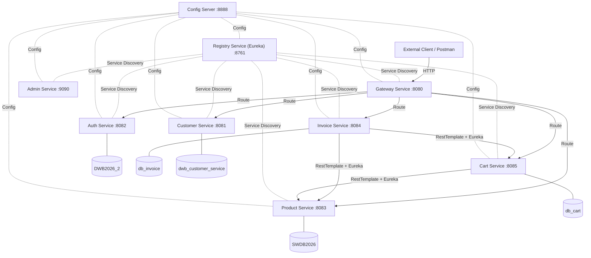

# Ecosistema de Microservicios SWDB 2026

Este es el repositorio orquestador central (**swdb-main**) para el proyecto final de la materia. Sirve como el punto de entrada unificado para la evaluación académica y contiene los scripts de configuración, colección de APIs para pruebas y las directrices globales del sistema.

---

## 📋 Directorio de Servicios

Todos los componentes de este ecosistema de microservicios están modularizados en sus propios repositorios independientes bajo la convención de nomenclatura `swdb-`:

| Servicio | Puerto | Descripción | Repositorio |
|---|---|---|---|
| **Orquestador Principal** | N/A | Scripts de inicio, base de datos y pruebas (este repositorio) | [swdb-main](./README.md) |
| **Config Server** | `8888` | Servidor central de configuración distribuida (Spring Cloud Config) | [swdb-config-server](../swdb-config-server/README.md) |
| **Registry Service** | `8761` | Servidor de descubrimiento de servicios (Netflix Eureka) | [swdb-registry-service](../swdb-registry-service/README.md) |
| **Gateway Service** | `8080` | Puerta de enlace unificada y enrutamiento perimetral (Spring Cloud Gateway) | [swdb-gateway-service](../swdb-gateway-service/README.md) |
| **Admin Service** | `9090` | Panel de monitoreo visual para administración (Spring Boot Admin) | [swdb-admin-service](../swdb-admin-service/README.md) |
| **Auth Service** | `8082` | Servicio de autenticación, registro y generación de tokens JWT | [swdb-auth-service](../swdb-auth-service/README.md) |
| **Product Service** | `8083` | Gestión de catálogo de productos, stock y categorías de venta | [swdb-product-service](../swdb-product-service/README.md) |
| **Customer Service** | `8081` | Gestión de perfiles de clientes asociados a usuarios de seguridad | [swdb-customer-service](../swdb-customer-service/README.md) |
| **Cart Service** | `8085` | Almacenamiento temporal y gestión de ítems en carritos de compra | [swdb-cart-service](../swdb-cart-service/README.md) |
| **Invoice Service** | `8084` | Orquestador transaccional que finaliza la compra y emite facturas | [swdb-invoice-service](../swdb-invoice-service/README.md) |

---

## Instrucciones de Configuración Inicial

Para levantar todo el ecosistema de forma local, por favor siga los siguientes pasos detallados:

### Paso 1: Configurar la Base de Datos en MySQL
1. Abra su cliente o consola de MySQL e inicie sesión como administrador (`root`).
2. Ejecute el script SQL que inicializa las bases de datos y configura el usuario de aplicación dedicado:
   ```bash
   mysql -u root -p < setup.sql
   ```
   *Este script se encargará de crear el usuario exclusivo `swdb_user` con contraseña `swdb_pass` y le asignará permisos totales sobre las 5 bases de datos que requiere la aplicación.*

### Paso 2: Iniciar los Microservicios
Ofrecemos dos alternativas para el arranque según su sistema operativo y herramientas:

*   **Opción A (Recomendada - Multiplataforma):**
    Si cuenta con Python 3 instalado, ejecute el orquestador inteligente:
    ```bash
    python3 run_services.py
    ```
    *Este script realiza una limpieza de puertos, arranca los servicios de forma ordenada (respetando dependencias críticas como el Servidor de Configuración y Eureka) y redirige las salidas a la carpeta `logs/`.*

*   **Opción B (Sistemas Unix/macOS):**
    Ejecute el script de Bash:
    ```bash
    chmod +x start.sh
    ./start.sh
    ```

*   **Opción C (Sistemas Windows):**
    Ejecute el archivo de procesamiento por lotes:
    ```cmd
    start.bat
    ```

---

## Guía de Pruebas y Validación (Postman & Bruno)

Hemos integrado una colección de APIs completa lista para importarse y ejecutarse en su herramienta de pruebas preferida (Postman, Bruno, Insomnia, etc.):

1. **Archivo de Colección:** [swdb-postman-collection.json](./swdb-postman-collection.json).
2. **Cómo Importar:** Abra Postman o Bruno, seleccione la opción **Import** y cargue el archivo JSON.
3. **Flujo de Ejecución:**
   * La colección cuenta con un orden lógico secuencial (Autenticación -> Clientes -> Productos -> Carrito -> Facturación).
   * **Variables de Entorno:** Utiliza la variable global `gateway_url` con valor predeterminado `http://localhost:8080`.
   * **JWT Automático:** Al ejecutar el endpoint de **Iniciar Sesión**, el script de prueba integrado guardará dinámicamente el token JWT en la variable de entorno `jwt_token`. Las siguientes peticiones usarán este token de manera automática en su cabecera `Authorization`.
4. **Verificación Automatizada:** Cada petición en la colección tiene pruebas (assertions) incorporadas que validan que el servidor responda con códigos exitosos (`200 OK` o `201 Created`) y un formato JSON correcto. Puede correr toda la colección en el **Collection Runner** para una evaluación automática del 100% del flujo.

---

## Estrategia de Ramificación (Git Branching Strategy)

Para mantener la granularidad del código y un control estricto de los cambios, todos los repositorios del ecosistema siguen un estándar estructurado de ramas:

1. **`main`**: Rama de producción. Solo contiene código estable y verificado. No se realizan cambios directos sobre esta rama.
2. **`release`**: Rama de estabilización previa a producción. Recibe las fusiones desde `develop` para pruebas integrales de regresión.
3. **`develop`**: Rama base de integración de desarrollo. Es el punto de partida para nuevas características.
4. **`feature/*`**: Ramas de características individuales (ej. `feature/setup-docs`, `feature/cart-crud`). Se crean desde `develop` y se reintegran a esta mediante Pull Requests tras pasar pruebas unitarias.

### Flujo de Granularidad de Commits
* Cada commit debe ser atómico (una sola funcionalidad lógica o corrección).
* Se debe usar el estándar Conventional Commits en español (ej. `feat: agregar controlador de carritos`, `fix: corregir validación de stock`).

---

## 📐 Diseño Arquitectónico del Sistema

A continuación se presenta el diagrama de arquitectura de alto nivel del ecosistema:



Para comprender el flujo detallado de mensajería, el patrón de descubrimiento Eureka, las reglas de ruteo del API Gateway y los diagramas secuenciales del checkout en la base de datos, consulte la documentación arquitectónica en español de México:
👉 **[Diseño de Alto Nivel (HLD)](file:///Users/toporaku/code/sdwb/projecto_final/swdb-main/docs/high-level-design.md)**
