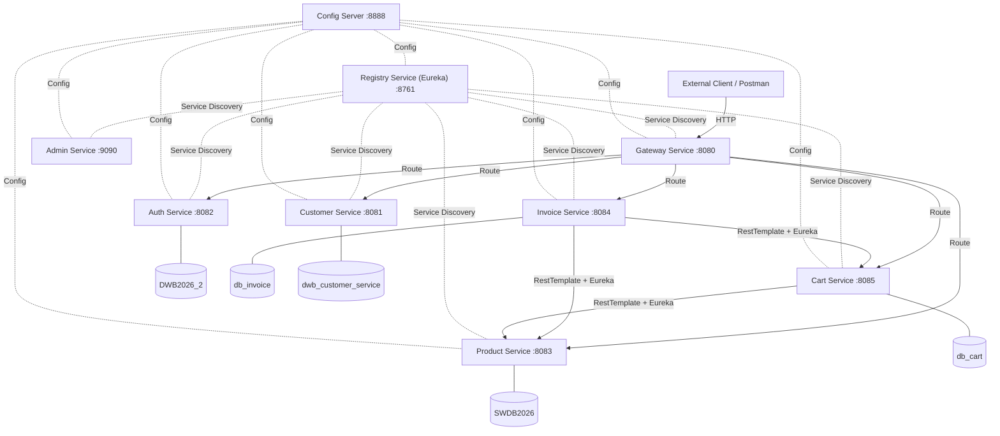
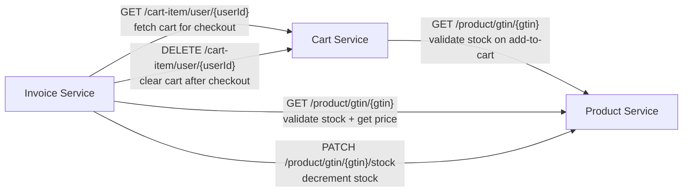
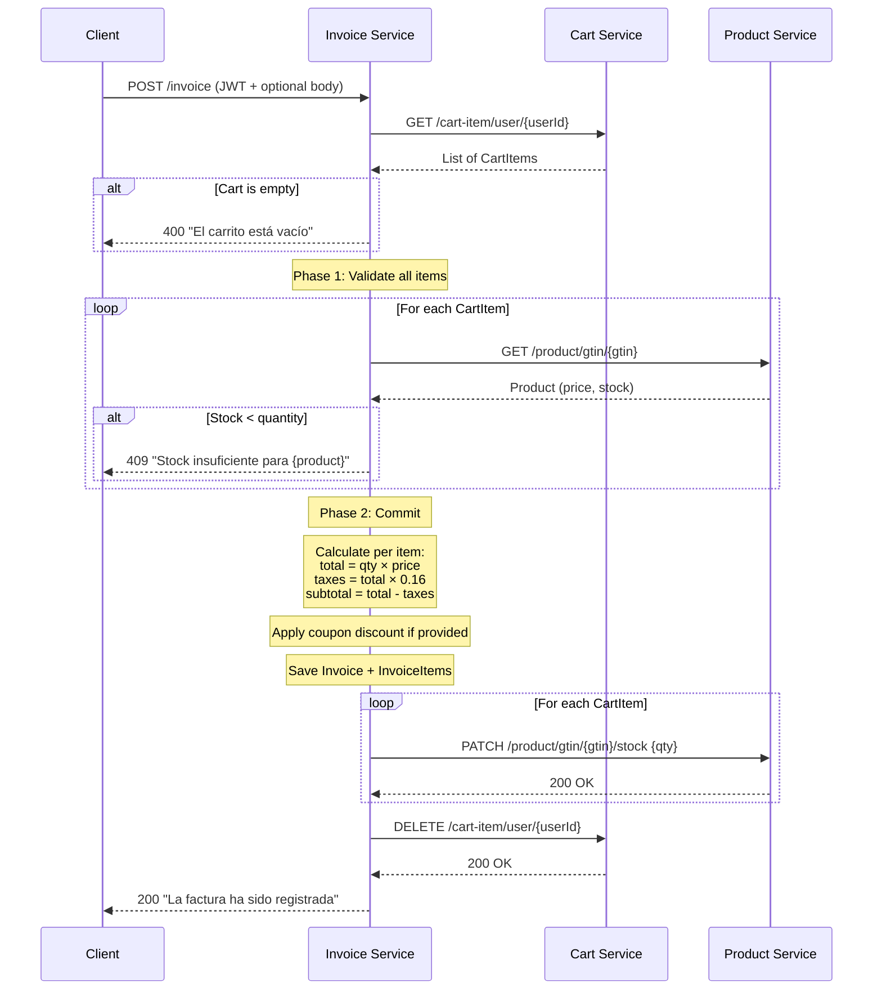

# High-Level Design: E-Commerce Microservices Backend

## Problem

The Desarrollo Web Backend 2026-2 final project requires a fully functional e-commerce backend built on a Spring Cloud microservice architecture. The system must support shopping cart management, invoice generation with tax calculation, and a checkout flow that orchestrates multiple services. Four infrastructure services (Config Server, Eureka Registry, API Gateway, Admin Dashboard) must tie the business services together. Three bonus features — shipping address, payment info, and discount coupons — add extra credit.

No existing codebase to extend; the project is greenfield. Reference implementations from the instructor exist at `reference/` and establish the code patterns, naming conventions, and library choices all services must follow. The reference services lack inter-service communication, Eureka registration, and Config Server integration — those are the core additions this project makes.

## Approach

Build nine Spring Boot services — four infrastructure, five business — each owning its own MySQL database (where applicable) and communicating via synchronous REST calls through Eureka service discovery. A centralized Config Server backed by a Git repository holds externalized configuration for all services. The API Gateway routes external client traffic; inter-service calls bypass the gateway and resolve service names directly through Eureka.

The checkout flow follows a **Validate-Then-Commit** pattern: the invoice service first validates all cart items against current stock levels without writing anything, then — only after full validation — saves the invoice, decrements stock for each item, and clears the cart. This eliminates the most common failure case (insufficient stock discovered mid-commit) without introducing saga/compensation complexity inappropriate for the project scope.

Authentication uses JWT tokens issued by the auth service. All business services validate tokens using a shared symmetric secret (HS256). Services that need the caller's identity (cart, invoice) extract `user_id` from JWT claims. Inter-service calls forward the client's original JWT in the `Authorization` header.

## Target Users

- **CUSTOMER**: Authenticated end-user who browses products, manages a shopping cart, and checks out to create invoices.
- **ADMIN**: Authenticated administrator who manages products, categories, and product images.
- **Course Instructor**: Evaluates the project against the rubric in `P-DWB2026-2.md`. The system must be demonstrable via Postman against a locally running service mesh.

## Goals

1. All nine services start, register with Eureka, and pull configuration from Config Server.
2. A CUSTOMER can add products to a cart, view the cart with product details, remove items, and clear the cart.
3. A CUSTOMER can check out (POST /invoice), which validates stock, calculates totals with 16% tax, saves the invoice, decrements stock, and clears the cart — all in one request.
4. The three bonus features (shipping address, payment info, discount coupons) are functional and exercised at checkout.
5. The full flow is demonstrable through the API Gateway using Postman: register → login → browse → cart → checkout → verify invoice and stock changes.

## Non-Goals

- **No frontend.** The system is API-only; all interaction is via Postman or curl.
- **No containerization.** All services run locally on the developer's machine; no Docker, Kubernetes, or cloud deployment.
- **No async messaging.** No message brokers (RabbitMQ, Kafka). All communication is synchronous REST.
- **No saga/compensation rollback.** The Validate-Then-Commit pattern handles the realistic failure case; full distributed transaction management is out of scope.
- **No CI/CD pipeline.** Build and run are manual (`mvn spring-boot:run`).
- **No rate limiting, circuit breakers, or distributed tracing.** These are production concerns beyond the course requirements.

## Tenets

- **Course-aligned over production-grade.** When a production pattern (circuit breakers, distributed tracing, saga rollbacks) conflicts with the instructor's reference patterns, follow the reference. A future maintainer is the grading instructor.
- **Reference patterns over idiomatic Spring.** When Spring Boot offers a newer/better way to do something (e.g., `WebClient` over `RestTemplate`, records over manual DTOs), prefer the pattern used in the reference code unless the reference pattern is broken on the standardized versions.
- **Separate databases over shared schemas.** Each microservice owns its data exclusively; no service reads another service's tables directly, even when co-located on the same MySQL instance.
- **Gateway for external, Eureka for internal.** The API Gateway routes external client traffic; inter-service calls use Eureka service discovery directly, bypassing the gateway.

## System Design

### Architecture Diagram

### Service Inventory

| Service | Port | Database | Spring App Name | Role |
|---------|------|----------|-----------------|------|
| Config Server | 8888 | — | config-service | Externalized configuration from Git repo |
| Registry (Eureka) | 8761 | — | registry-service | Service discovery |
| Gateway | 8080 | — | gateway-service | External traffic routing (Spring Cloud Gateway MVC) |
| Admin | 9090 | — | admin-service | Spring Boot Admin dashboard |
| Auth | 8082 | db_auth | auth | User registration, login, JWT issuance |
| Product | 8083 | SWDB2026 | product | Product/category CRUD, GTIN lookup, stock management |
| Cart | 8085 | db_cart | cart-service | Shopping cart CRUD (brand new service) |
| Invoice | 8084 | db_invoice | invoice | Checkout orchestration, invoice persistence, bonus features |
| Customer | 8081 | dwb_customer_service | customer-service | Customer profile management |

### Startup Order

Services must start in dependency order:

1. Config Server (8888) — all others depend on it for configuration
2. Registry Service (8761) — all others register here
3. Gateway Service (8080)
4. Admin Service (9090)
5. Auth Service (8082)
6. Product Service (8083)
7. Cart Service (8085)
8. Invoice Service (8084)
9. Customer Service (8081)

### Tech Stack

- **Java 21**, **Spring Boot 4.0.6**, **Spring Cloud 2025.1.1** — standardized across all services
- **MySQL 9.x** on localhost:3306 — separate database per service
- **Maven** build system
- **jjwt 0.11.5** — symmetric HS256 JWT with shared secret
- **springdoc-openapi 2.8.6** — Swagger/OpenAPI documentation per service

### Inter-Service Communication

- **Mechanism**: `RestTemplate` bean annotated with `@LoadBalanced`, resolving service names via Eureka (e.g., `http://PRODUCT/product/gtin/{gtin}`).
- **Authentication**: The calling service forwards the client's JWT in the `Authorization` header. The receiving service validates the token normally through its JWT filter.

### JWT Authentication

Two JWT filter patterns coexist:

1. **Invoice/Cart pattern** — Extracts `user_id` from token claims into `SecurityContext.credentials` as a Map. Uses `hasAuthority("CUSTOMER")` / `hasAuthority("ADMIN")` (no `ROLE_` prefix). Used by cart-service and invoice-service because they need the caller's identity.

2. **Product pattern** — Uses `ROLE_` prefix and `hasRole()`. No `user_id` extraction. Product-service does not need to know who the caller is, only that they have the right role.

All services share the JWT secret: `mi_clave_super_secreta_para_jwt_segura_2026_abcdef`.

### Checkout Flow (Validate-Then-Commit)

### Gateway Routing

All external traffic enters through the Gateway at port 8080. Routes use `StripPrefix=1`:

| External Path | Target Service (Eureka) |
|--------------|------------------------|
| `/auth-service/**` | `lb://AUTH` |
| `/product-service/**` | `lb://PRODUCT` |
| `/cart-service/**` | `lb://CART-SERVICE` |
| `/invoice-service/**` | `lb://INVOICE` |
| `/customer-service/**` | `lb://CUSTOMER-SERVICE` |

### Config Server

The Config Server pulls configuration from a local Git repository (`config-data/`). Each service has a corresponding properties/YAML file named by its `spring.application.name`. Services connect to Config Server on startup via `spring-cloud-starter-config` and `spring.config.import=optional:configserver:http://localhost:8888`.

### Code Patterns (from Reference)

All services follow these patterns established by the instructor's reference code:

- **Controller**: `@RestController` + `@RequestMapping` + `@Tag` for Swagger. Delegates to service interface.
- **Service**: Interface + `@Service` implementation. Try-catch wrapping `DataAccessException` → `DBAccessException`. Business validation via `ApiException(HttpStatus, message)`.
- **Repository**: `JpaRepository` with native SQL `@Query`. `@Modifying` + `@Transactional` for writes.
- **Entity**: `@Entity` + `@Table` with `@Column` annotations. Manual getters/setters (except auth-service which uses Lombok).
- **Exception handling**: `ApiException`, `DBAccessException`, `RestExceptionHandler` as `@ControllerAdvice`.

## Key Design Decisions

| Decision | Choice | Alternatives Considered | Rationale |
|----------|--------|------------------------|-----------|
| Cart service location | Standalone microservice with own database (`db_cart`) | Embed cart tables in invoice-service database | Microservice data isolation; cart has its own bounded context (CRUD lifecycle independent of invoicing). The reference invoice-service SecurityConfig had `/cart-item/**` routes suggesting the instructor originally planned embedding, but a separate service better demonstrates the microservice architecture requirement. |
| Checkout integrity | Validate-Then-Commit (two-phase) | Best-effort sequential; Saga with compensation | Eliminates the realistic failure (stock exhausted between check and write) without saga complexity. The validation pass is a single extra loop — minimal cost. Full saga is overkill for a local dev project. |
| Inter-service communication | `RestTemplate` + `@LoadBalanced` via Eureka | `WebClient` (reactive); `FeignClient` (declarative); calls through Gateway | `RestTemplate` matches the Spring Web MVC stack used by all services. `WebClient` requires reactive dependencies. `FeignClient` adds a new abstraction. Gateway routing adds an unnecessary hop for trusted internal traffic. |
| JWT forwarding | Forward client's original JWT | Service-to-service tokens; mTLS | Simplest approach — the receiving service authenticates the call using the same JWT filter it uses for external calls. No new token issuance mechanism needed. |
| Spring Boot version | 4.0.6 for all services | Keep reference versions (4.0.6 infra, 4.0.3 product, 3.5.7 invoice) | Standardizing avoids dependency conflicts and simplifies the build. 4.0.6 is the latest version used in the infrastructure references. |
| Bonus features location | All three inside invoice-service | Separate payment/shipping/coupon services | The features are tightly coupled to the checkout flow. Separate services would add complexity with no architectural benefit. |

## Design Tree — Segments

The project decomposes into six LLD segments, built in dependency order:

| Segment | Prefix | Services Covered | Key Responsibilities |
|---------|--------|-----------------|---------------------|
| Infrastructure | INFRA | config-server, config-data, registry-service, gateway-service, admin-service | Externalized config, service discovery, routing, monitoring |
| Auth | AUTH | auth-service | User registration, login, JWT token issuance |
| Product | PROD | product-service | Product/category CRUD, GTIN lookup, stock update endpoint |
| Cart | CART | cart-service | Shopping cart CRUD, stock validation on add, internal endpoints for checkout |
| Invoice | INV | invoice-service | Checkout orchestration, invoice persistence, tax calculation, bonus features (shipping, payment, coupons) |
| Customer | CUST | customer-service | Customer profile CRUD, image upload |

## Success Metrics

1. **All nine services register in Eureka** — visible on the Eureka dashboard at `http://localhost:8761`.
2. **Full checkout flow succeeds** — Register user → Login → Add products to cart → POST /invoice → Invoice saved, stock decremented, cart cleared.
3. **Stock validation rejects insufficient stock** — Adding more items than available stock returns an error at both add-to-cart and checkout.
4. **Bonus features work** — Shipping address and payment info are persisted on the invoice; a valid coupon code applies a percentage discount.
5. **Config Server drives configuration** — Changing a value in config-data and refreshing picks up the new value.
6. **Admin dashboard shows all services** — Spring Boot Admin at `http://localhost:9090` lists all registered services with health status.

## References

- [P-DWB2026-2.md](file:///Users/toporaku/code/sdwb/projecto_final/P-DWB2026-2.md) — Original course requirements
- [LID_CONTEXT.md](file:///Users/toporaku/code/sdwb/projecto_final/LID_CONTEXT.md) — Pre-resolved architecture decisions and reference code analysis
- [reference/](file:///Users/toporaku/code/sdwb/projecto_final/reference) — Instructor's reference implementations
